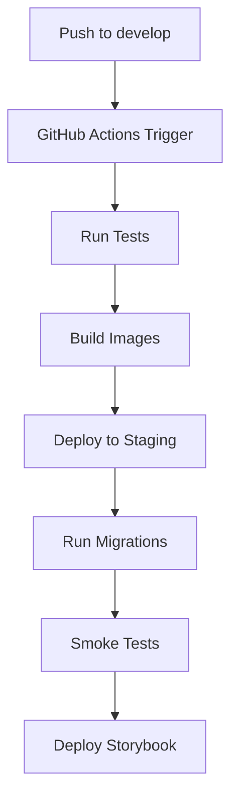
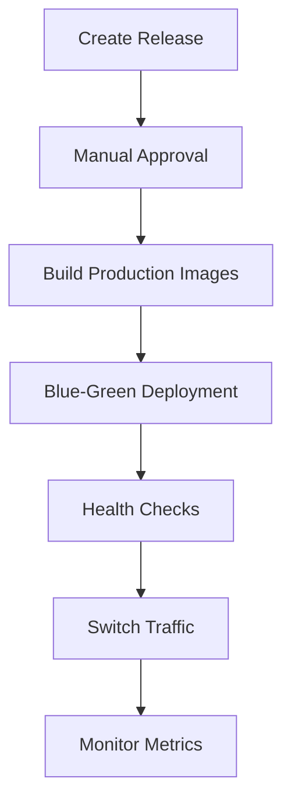

# CarbonLedger Deployment Guide

This guide covers deployment procedures for all CarbonLedger environments, including the new staging environment and enhanced log aggregation system.

## Table of Contents

1. [Environment Overview](#environment-overview)
2. [Staging Environment Setup](#staging-environment-setup)
3. [Log Aggregation System](#log-aggregation-system)
4. [Deployment Workflows](#deployment-workflows)
5. [Monitoring and Alerting](#monitoring-and-alerting)
6. [Troubleshooting](#troubleshooting)

## Environment Overview

CarbonLedger supports multiple deployment environments:

- **Development**: Local development with hot reloading
- **Staging**: Pre-production testing on Stellar testnet with separate contracts
- **Testnet**: Shared testing environment on Stellar testnet
- **Production**: Live environment on Stellar mainnet

### Environment Separation

Each environment uses:
- Separate PostgreSQL databases
- Isolated contract instances (even on the same Stellar network)
- Environment-specific configuration
- Dedicated monitoring and logging

## Staging Environment Setup

The staging environment provides isolated testing without affecting the shared testnet environment.

### Prerequisites

1. **Server Requirements**:
   - Ubuntu 20.04+ or similar Linux distribution
   - Docker 20.10+ and Docker Compose v2
   - 4GB+ RAM, 50GB+ storage
   - SSL certificates for HTTPS endpoints

2. **Required Secrets**:
   - Staging-specific Stellar keypairs
   - Separate contract addresses deployed to testnet
   - Database credentials
   - JWT secrets

### Configuration Files

1. **Environment Variables**: Copy `.env.staging.example` to `.env.staging` and fill in values:
   ```bash
   cp .env.staging.example .env.staging
   # Edit .env.staging with staging-specific values
   ```

2. **Docker Compose**: Use the staging overlay:
   ```bash
   docker compose -f docker-compose.yml -f docker-compose.staging.yml up -d
   ```

### Staging Deployment Process

1. **Initial Setup**:
   ```bash
   # Clone repository
   git clone https://github.com/dev-fatima-24/carbonledger.git
   cd carbonledger
   
   # Checkout staging branch
   git checkout develop
   
   # Configure environment
   cp .env.staging.example .env.staging
   # Edit .env.staging with your values
   
   # Deploy contracts to testnet (separate instances)
   cd contracts
   ./deploy-staging.sh  # Creates separate contract instances
   
   # Update .env.staging with new contract addresses
   ```

2. **Deploy Services**:
   ```bash
   # Pull latest images
   docker compose -f docker-compose.yml -f docker-compose.staging.yml pull
   
   # Start services
   docker compose -f docker-compose.yml -f docker-compose.staging.yml up -d
   
   # Run database migrations
   docker compose -f docker-compose.yml -f docker-compose.staging.yml \
     exec backend npx prisma migrate deploy
   
   # Seed staging database
   docker compose -f docker-compose.yml -f docker-compose.staging.yml \
     exec backend npx ts-node prisma/seed-staging.ts
   ```

3. **Verify Deployment**:
   ```bash
   # Check service health
   curl https://staging-api.carbonledger.com/health
   curl https://staging.carbonledger.com
   
   # Verify contract addresses
   curl https://staging-api.carbonledger.com/api/v1/health | jq '.contracts'
   ```

### GitHub Actions Staging Workflow

The staging deployment is automated via GitHub Actions:

- **Trigger**: Push to `develop` branch
- **Process**: 
  1. Run full test suite
  2. Build and push Docker images
  3. Deploy to staging server via SSH
  4. Run smoke tests
  5. Deploy Storybook

**Required GitHub Secrets**:
```
STAGING_SSH_HOST=staging.carbonledger.com
STAGING_SSH_USER=deploy
STAGING_SSH_KEY=<private_key>
STAGING_URL=https://staging.carbonledger.com
STAGING_API_URL=https://staging-api.carbonledger.com/api/v1
STORYBOOK_STAGING_URL=https://storybook-staging.carbonledger.com
STAGING_REGISTRY_CONTRACT_ID=<contract_id>
STAGING_CREDIT_CONTRACT_ID=<contract_id>
STAGING_MARKETPLACE_CONTRACT_ID=<contract_id>
STAGING_ORACLE_CONTRACT_ID=<contract_id>
STAGING_USDC_CONTRACT_ID=<contract_id>
```

## Log Aggregation System

The enhanced log aggregation system provides centralized logging, search capabilities, and alerting.

### Architecture

- **Loki**: Log storage and indexing
- **Promtail**: Log collection from Docker containers
- **Grafana**: Visualization, dashboards, and alerting
- **Docker Logging Driver**: JSON structured logging

### Features

1. **Centralized Storage**: All service logs in one location
2. **Searchable by**:
   - Service name
   - Log level (error, warn, info, debug)
   - Correlation ID
   - Time range
   - Custom fields (user_id, request_id, etc.)

3. **30-Day Retention**: Automatic log cleanup after 30 days
4. **Real-time Alerting**: Alerts on error patterns
5. **Correlation Tracking**: Request tracing across services

### Log Format

Services should emit structured JSON logs:

```json
{
  "timestamp": "2024-05-29T10:30:00.123Z",
  "level": "error",
  "service": "backend",
  "message": "Database connection failed",
  "correlationId": "req_abc123",
  "userId": "user_456",
  "context": {
    "method": "POST",
    "endpoint": "/api/v1/projects",
    "duration_ms": 1250
  }
}
```

### Querying Logs

**Grafana LogQL Examples**:

```logql
# All error logs in last hour
{service=~".+"} | json | level="error"

# Backend errors with correlation ID
{service="backend"} | json | level="error" | correlation_id != ""

# Database connection errors across all services
{service=~".+"} | json | message=~".*database.*connection.*"

# High-latency requests (>5 seconds)
{service="backend"} | json | duration_ms > 5000

# Logs for specific user session
{service=~".+"} | json | user_id="user_123"

# Error rate by service (last 5 minutes)
sum by (service) (count_over_time({service=~".+"} | json | level="error" [5m]))
```

### Alerting Rules

**Configured Alerts**:

1. **High Error Rate**: >10 errors/minute across all services
2. **Service-Specific Errors**: Backend service errors
3. **Oracle Health**: Oracle service degradation
4. **Database Issues**: Connection/query problems

**Alert Destinations**:
- Slack/Discord webhooks
- Email notifications
- PagerDuty integration (production)

### Accessing Logs

1. **Grafana Dashboard**: https://grafana.carbonledger.com
   - Username: admin
   - Password: (from GRAFANA_PASSWORD env var)

2. **Direct Loki API**:
   ```bash
   # Query API directly
   curl -G -s "http://loki:3100/loki/api/v1/query_range" \
     --data-urlencode 'query={service="backend"}' \
     --data-urlencode 'start=2024-05-29T10:00:00Z' \
     --data-urlencode 'end=2024-05-29T11:00:00Z'
   ```

## Deployment Workflows

### Staging Deployment



### Production Deployment



## Monitoring and Alerting

### Key Metrics

1. **Application Health**:
   - Service uptime
   - Response times
   - Error rates
   - Database connection pool usage

2. **Business Metrics**:
   - Carbon credit transactions
   - Oracle price updates
   - User registrations
   - Project verifications

3. **Infrastructure**:
   - CPU/Memory usage
   - Disk space
   - Network I/O
   - Container restarts

### Alert Thresholds

| Metric | Warning | Critical |
|--------|---------|----------|
| Error Rate | >5/min | >10/min |
| Response Time | >2s | >5s |
| CPU Usage | >70% | >90% |
| Memory Usage | >80% | >95% |
| Disk Space | >80% | >95% |

## Troubleshooting

### Common Issues

1. **Service Won't Start**:
   ```bash
   # Check logs
   docker compose logs <service_name>
   
   # Check health
   docker compose ps
   
   # Restart service
   docker compose restart <service_name>
   ```

2. **Database Connection Issues**:
   ```bash
   # Check PostgreSQL logs
   docker compose logs postgres
   
   # Test connection
   docker compose exec backend npx prisma db pull
   
   # Check connection pool
   curl http://localhost:3001/health/db
   ```

3. **Log Aggregation Issues**:
   ```bash
   # Check Loki status
   curl http://localhost:3100/ready
   
   # Check Promtail logs
   docker compose logs promtail
   
   # Verify log ingestion
   curl -G "http://localhost:3100/loki/api/v1/query" \
     --data-urlencode 'query={service="backend"}'
   ```

4. **Contract Deployment Issues**:
   ```bash
   # Check Stellar network status
   curl https://horizon-testnet.stellar.org/
   
   # Verify contract addresses
   soroban contract invoke --id <contract_id> --source <keypair> -- --help
   
   # Check oracle service logs
   docker compose logs oracle_verification
   ```

### Log Analysis

**Finding Root Causes**:

1. **Use Correlation IDs**: Track requests across services
2. **Check Error Context**: Look for stack traces and error codes
3. **Monitor Resource Usage**: CPU/memory spikes during errors
4. **Verify External Dependencies**: Stellar network, IPFS, APIs

**Performance Issues**:

1. **Database Queries**: Check slow query logs
2. **API Response Times**: Monitor endpoint latency
3. **Memory Leaks**: Watch for gradual memory increases
4. **Connection Pools**: Monitor database connection usage

### Emergency Procedures

1. **Service Outage**:
   - Check service health endpoints
   - Review recent deployments
   - Check resource usage
   - Scale services if needed
   - Rollback if necessary

2. **Data Issues**:
   - Stop affected services
   - Create database backup
   - Investigate data corruption
   - Restore from backup if needed
   - Resume services

3. **Security Incident**:
   - Isolate affected systems
   - Review access logs
   - Rotate compromised credentials
   - Update security configurations
   - Monitor for further issues

## Support and Maintenance

### Regular Tasks

1. **Daily**:
   - Check service health
   - Review error logs
   - Monitor resource usage

2. **Weekly**:
   - Update dependencies
   - Review security alerts
   - Backup verification

3. **Monthly**:
   - Security patches
   - Performance optimization
   - Capacity planning

### Contact Information

- **Development Team**: dev@carbonledger.com
- **DevOps/Infrastructure**: devops@carbonledger.com
- **Security Issues**: security@carbonledger.com
- **Emergency Hotline**: +1-XXX-XXX-XXXX

---

*Last Updated: May 29, 2026*
*Version: 2.0.0*