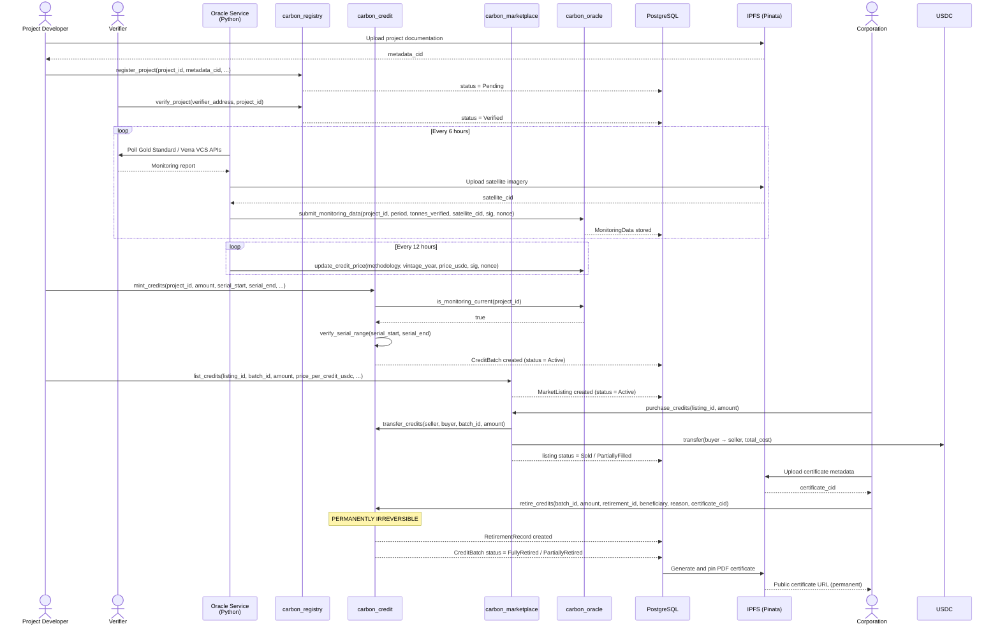

# Carbon Credit Lifecycle

> **Complete reference for the CarbonLedger credit lifecycle** — actors, contract functions, on-chain data, off-chain data, error conditions, and edge cases for each stage.

---

## Table of Contents

- [Overview](#overview)
- [Actors](#actors)
- [Sequence Diagram](#sequence-diagram)
- [Stage 1 — Project Registration](#stage-1--project-registration)
- [Stage 2 — Verification](#stage-2--verification)
- [Stage 3 — Oracle Monitoring](#stage-3--oracle-monitoring)
- [Stage 4 — Credit Minting](#stage-4--credit-minting)
- [Stage 5 — Marketplace Listing](#stage-5--marketplace-listing)
- [Stage 6 — Purchase](#stage-6--purchase)
- [Stage 7 — Retirement](#stage-7--retirement)
- [Stage 8 — Certification](#stage-8--certification)
- [Error Reference](#error-reference)

---

## Overview

A carbon credit travels through eight stages from a real-world offset project to a permanent, publicly verifiable retirement record. Each stage maps to one or more Soroban contract calls and database writes. The lifecycle is designed so that fraud, double-counting, and greenwashing are prevented at the smart-contract level — not just by policy.

```
 Registration → Verification → Oracle Monitoring → Minting
      ↓               ↓               ↓               ↓
  Pending          Verified      Data on-chain    Serial numbers
                                                   assigned
                                                       ↓
                                              Marketplace Listing
                                                       ↓
                                                   Purchase
                                                       ↓
                                                  Retirement  ←── IRREVERSIBLE
                                                       ↓
                                               Certification
                                          (permanent public URL)
```

---

## Actors

| Actor | Role |
|-------|------|
| **Project Developer** | Registers projects, requests credit minting, receives USDC payments |
| **Accredited Verifier** | Approves or rejects projects; submits on-chain attestations |
| **Oracle Service** | Python bridge that posts satellite monitoring data and price feeds to contracts |
| **Corporation** | Buys credits from the marketplace and retires them for ESG offset claims |
| **Admin** | Deploys and upgrades contracts; maintains the verifier allow-list |
| **Public / Auditor** | Read-only access to audit trail — no wallet required |

---

## Sequence Diagram



---

## Stage 1 — Project Registration

**Summary:** A project developer submits a new carbon offset project for review. The project is stored on-chain with `Pending` status and cannot issue credits until a verifier approves it.

### Actors Involved

| Actor | Action |
|-------|--------|
| Project Developer | Fills registration form with project details and uploads documentation |
| Admin | Signs the `register_project` transaction (acts as contract gatekeeper) |

### Contract Called

**Contract:** `carbon_registry`  
**Function:** `register_project`

```rust
register_project(
    env: Env,
    admin: Address,
    project_id: String,     // globally unique identifier (e.g. "REDD-2024-BRA-001")
    name: String,
    metadata_cid: String,   // IPFS CID pointing to project documentation
    verifier_address: Address,
    methodology: String,    // e.g. "REDD+", "VCS-VM0015", "Gold Standard"
    country: String,        // ISO 3166-1 alpha-3
    project_type: String,   // e.g. "reforestation", "blue_carbon", "methane_capture"
    vintage_year: u32,      // baseline year (e.g. 2023)
)
```

### Data Stored On-Chain

Stored in `carbon_registry` contract storage under key `Project(project_id)`:

```rust
CarbonProject {
    project_id: String,
    name: String,
    methodology: String,
    country: String,
    project_type: String,
    verifier_address: Address,
    metadata_cid: String,          // IPFS CID
    total_credits_issued: i128,    // starts at 0
    total_credits_retired: i128,   // starts at 0
    methodology_score: u32,        // 0–100; must be ≥ 70 to advance
    status: ProjectStatus::Pending,
    vintage_year: u32,
    created_at: u64,               // ledger timestamp
}
```

### Data Stored Off-Chain

| Store | Table / Object | Fields |
|-------|---------------|--------|
| PostgreSQL | `CarbonProject` | id, projectId, name, description, methodology, country, projectType, status, vintageYear, methodologyScore, metadataCid, verifierAddress, ownerAddress, coordinates (JSON), createdAt |
| IPFS | Project documentation bundle | Project feasibility study, methodology application, land title or legal proof, baseline survey data |

### Error Conditions

| Error Code | Constant | Trigger |
|-----------|----------|---------|
| 17 | `ProjectAlreadyExists` | A project with the same `project_id` is already registered |
| 20 | `MethodologyScoreLow` | Computed `methodology_score` is below 70 |
| 19 | `AlreadyInitialized` | Contract `initialize()` called a second time |

### Edge Cases

- **Duplicate project IDs** are rejected at the contract level; the backend generates IDs using a combination of methodology code, vintage year, country, and a UUID suffix.
- **Metadata CID validation** is done off-chain before submission — the backend verifies the CID resolves on the IPFS gateway before calling `register_project`.
- **Verifier assignment** happens at registration time and cannot be changed without admin intervention.

---

## Stage 2 — Verification

**Summary:** An accredited verifier reviews the project documentation and either approves or rejects it. Approval is an on-chain transaction that moves the project from `Pending` to `Verified`. Only verifiers on the contract's allow-list can call this function.

### Actors Involved

| Actor | Action |
|-------|--------|
| Accredited Verifier | Reviews off-chain docs, calls `verify_project` or `reject_project` |
| Oracle Service | `verification_listener.py` polls Gold Standard and Verra VCS APIs every 6 hours for automated attestation signals |

### Contracts Called

**Contract:** `carbon_registry`

```rust
// Approve
verify_project(
    env: Env,
    verifier_address: Address,  // must be in the Verifiers allow-list
    project_id: String,
)

// Reject (permanent)
reject_project(
    env: Env,
    verifier_address: Address,
    project_id: String,
    reason: String,             // stored on-chain for transparency
)

// Administrative hold
suspend_project(
    env: Env,
    admin: Address,
    project_id: String,
    reason: String,
)
```

### Data Stored On-Chain

The `CarbonProject.status` field is updated in-place:

| Outcome | `status` value |
|---------|---------------|
| Approved | `ProjectStatus::Verified` |
| Rejected | `ProjectStatus::Rejected` |
| Suspended | `ProjectStatus::Suspended` |

The `reason` string for rejection/suspension is stored in the contract event log.

### Data Stored Off-Chain

| Store | Table / Object | Fields Updated |
|-------|---------------|----------------|
| PostgreSQL | `CarbonProject` | `status`, `updatedAt` |
| PostgreSQL | `AuditLog` | actor, action, project_id, reason, timestamp |

### Error Conditions

| Error Code | Constant | Trigger |
|-----------|----------|---------|
| 1 | `ProjectNotFound` | `project_id` does not exist in contract storage |
| 7 | `UnauthorizedVerifier` | Caller address is not in the `Verifiers` storage list |
| 3 | `ProjectSuspended` | Attempting to verify a project that is already suspended |

### Edge Cases

- **Re-verification after rejection** is not possible — a rejected project must be re-registered with a new `project_id` and corrected documentation.
- **Verifier rotation** — the verifier allow-list is managed by admin. If a verifier's accreditation lapses, admin removes them and the assigned projects must be re-assigned.
- **Automated attestation** — `verification_listener.py` detects when a project has received a positive signal from a Gold Standard or Verra VCS API and can trigger `verify_project` automatically. Manual override is always available.

---

## Stage 3 — Oracle Monitoring

**Summary:** The oracle service continuously collects real-world monitoring data (satellite imagery, methodology assessments) and posts it on-chain. This data is a prerequisite for minting — credits cannot be issued against stale monitoring data older than 365 days.

### Actors Involved

| Actor | Action |
|-------|--------|
| Oracle Service | `verification_listener.py` (6-hour poll), `satellite_monitor.py` (webhook receiver) |
| Satellite Providers | Google Earth Engine sends webhook events with imagery; Planet Labs API provides independent validation |
| Oracle Service | `price_oracle.py` posts benchmark prices every 12 hours |

### Contracts Called

**Contract:** `carbon_oracle`

```rust
// Submit monitoring data for a project period
submit_monitoring_data(
    env: Env,
    oracle_signer: Address,
    project_id: String,
    period: String,            // e.g. "2024-Q1", "2024-H1", "2024"
    tonnes_verified: i128,     // CO2e tonnes measured for this period
    methodology_score: u32,    // recalculated per-period (0–100)
    satellite_cid: String,     // IPFS CID of satellite imagery bundle
    signature: BytesN<64>,     // Ed25519 signature over (project_id + period + nonce)
    nonce: u64,                // monotonically increasing, prevents replay attacks
)

// Push benchmark price for a methodology + vintage combination
update_credit_price(
    env: Env,
    oracle_signer: Address,
    methodology: String,
    vintage_year: u32,
    price_usdc: i128,          // in stroops: 1 USDC = 10_000_000 stroops
    signature: BytesN<64>,
    nonce: u64,
)

// Flag a project for investigation (triggers suspension workflow)
flag_project(
    env: Env,
    oracle_signer: Address,
    project_id: String,
    reason: String,
    signature: BytesN<64>,
    nonce: u64,
)
```

### Data Stored On-Chain

Stored in `carbon_oracle` contract storage:

```rust
// Key: MonitoringData(project_id, period)
MonitoringData {
    project_id: String,
    period: String,
    tonnes_verified: i128,
    methodology_score: u32,
    satellite_cid: String,
    submitted_by: Address,
    submitted_at: u64,       // ledger timestamp
}

// Key: LatestMonitoring(project_id) → period string (pointer to latest)
// Key: BenchmarkPrice(methodology, vintage_year) → price in stroops
// Key: OracleNonce → u64 (incremented per submission; prevents replay)
```

### Data Stored Off-Chain

| Store | Table / Object | Fields |
|-------|---------------|--------|
| IPFS | Satellite imagery bundle | GeoTIFF files, biomass density maps, change detection overlays |
| PostgreSQL | `MonitoringData` | projectId, period, tonnesVerified, methodologyScore, satelliteCid, submittedBy, submittedAt |
| PostgreSQL | `OracleUpdate` | idempotencyKey, type (monitoring/price), txHash, status, attempts, lastError |

### Error Conditions

| Error Code | Constant | Trigger |
|-----------|----------|---------|
| 8 | `UnauthorizedOracle` | Caller is not the registered oracle signer |
| 22 | `InvalidNonce` | Submitted nonce ≤ current stored nonce (replay attack prevention) |
| 23 | `InvalidSignature` | Ed25519 signature verification fails |
| 13 | `MonitoringDataStale` | `is_monitoring_current()` returns false — latest data is > 365 days old |

### Edge Cases

- **Monitoring freshness gate** — `is_monitoring_current(project_id)` is called by the credit contract during minting. If it returns false, minting is blocked regardless of other conditions.
- **Nonce replay protection** — Each oracle submission must include a nonce strictly greater than the stored nonce. The oracle service reads the current nonce before each submission.
- **Oracle key rotation** — `rotate_oracle(env, admin, new_oracle, new_pub_key)` allows replacing the oracle keypair without redeploying the contract. Old submissions remain valid under the historical nonce chain.
- **Price deviation alert** — The oracle service checks the previous benchmark price before submitting. If the new price differs by more than 15%, it sends an alert to `ADMIN_ALERT_WEBHOOK` and waits for manual approval before posting.
- **Multiple monitoring periods** — Each `(project_id, period)` pair is stored independently. The oracle stores a `LatestMonitoring` pointer for fast freshness checks during minting.

---

## Stage 4 — Credit Minting

**Summary:** The project developer requests issuance of a credit batch corresponding to verified tonnes. The contract assigns globally unique serial numbers to every credit in the batch, preventing double-counting at the mathematical level.

### Actors Involved

| Actor | Action |
|-------|--------|
| Project Developer | Submits mint request via dashboard with the amount to issue |
| Admin | Signs the `mint_credits` transaction |

### Contract Called

**Contract:** `carbon_credit`  
**Function:** `mint_credits`

```rust
mint_credits(
    env: Env,
    admin: Address,
    project_id: String,
    amount: i128,              // tonnes to mint; max 1_000_000_000
    vintage_year: u32,
    batch_id: String,          // globally unique batch identifier
    serial_start: u64,         // start of serial number range (inclusive)
    serial_end: u64,           // end of serial number range (inclusive)
    metadata_cid: String,      // IPFS CID for this batch's documentation
    initial_owner: Address,    // project developer's Stellar address
)
```

The contract calls `carbon_oracle.is_monitoring_current(project_id)` before minting and calls `verify_serial_range(serial_start, serial_end)` to check the `SerialRegistry` for collisions.

### Data Stored On-Chain

```rust
// Key: Batch(batch_id)
CreditBatch {
    batch_id: String,
    project_id: String,
    vintage_year: u32,
    amount: i128,
    serial_start: u64,
    serial_end: u64,
    issued_at: u64,
    status: CreditStatus::Active,
    metadata_cid: String,
    owner: Address,
}

// Key: ProjectBatches(project_id) → Vec<String>  (appended)
// Key: SerialRegistry → Vec<SerialRange>          (appended; checked on every mint)
```

**Event emitted:**
```rust
CreditMintedEvent {
    batch_id, project_id, admin, amount,
    vintage_year, serial_start, serial_end, timestamp
}
```

### Data Stored Off-Chain

| Store | Table / Object | Fields |
|-------|---------------|--------|
| PostgreSQL | `CreditBatch` | id, batchId, projectId, vintageYear, amount, serialStart, serialEnd, status, metadataCid, issuedAt |
| IPFS | Batch documentation | Monitoring period reports, methodology calculation workbook, third-party audit reports |

### Error Conditions

| Error Code | Constant | Trigger |
|-----------|----------|---------|
| 2 | `ProjectNotVerified` | Project status is not `Verified` |
| 3 | `ProjectSuspended` | Project is under suspension |
| 6 | `SerialNumberConflict` | Proposed `[serial_start, serial_end]` overlaps any range in `SerialRegistry` |
| 18 | `InvalidSerialRange` | `serial_start > serial_end` or range exceeds `amount` |
| 16 | `ZeroAmountNotAllowed` | `amount` is 0 |
| 13 | `MonitoringDataStale` | Oracle freshness check fails (> 365 days) |
| 20 | `MethodologyScoreLow` | Methodology score in latest monitoring data is < 70 |

### Edge Cases

- **Serial number collision** — `verify_serial_range` scans the entire `SerialRegistry` before minting. This is the core anti-double-counting mechanism. The backend pre-computes the next available serial range by querying the highest `serial_end` across all existing batches.
- **Batch size cap** — A single batch cannot exceed `MAX_BATCH_SIZE` (1,000,000,000 credits). Large projects split issuance across multiple batches.
- **Partial issuance** — Developers can mint less than the total verified tonnes (e.g., issue in tranches). Each tranche is a separate batch with non-overlapping serial ranges.
- **Registry increment** — `increment_issued(env, oracle_address, project_id, amount)` is called on `carbon_registry` after a successful mint to track `total_credits_issued` against `total_credits_retired`.

---

## Stage 5 — Marketplace Listing

**Summary:** A credit owner (typically the project developer) makes some or all of a batch available for purchase at a specified price per tonne. Listings are public and browsable without a wallet.

### Actors Involved

| Actor | Action |
|-------|--------|
| Credit Owner (Project Developer) | Creates a listing specifying amount and price |
| Oracle Service | `price_oracle.py` posts benchmark prices to `carbon_oracle` for reference |

### Contract Called

**Contract:** `carbon_marketplace`  
**Function:** `list_credits`

```rust
list_credits(
    env: Env,
    seller: Address,
    listing_id: String,
    batch_id: String,
    project_id: String,
    amount: i128,
    price_per_credit_usdc: i128,   // in stroops (1 USDC = 10_000_000)
    vintage_year: u32,
    methodology: String,
    country: String,
)
```

Sellers can remove an unsold listing with:

```rust
delist_credits(
    env: Env,
    seller: Address,
    listing_id: String,
)
```

### Data Stored On-Chain

```rust
// Key: Listing(listing_id)
MarketListing {
    listing_id: String,
    seller: Address,
    batch_id: String,
    project_id: String,
    amount_available: i128,
    price_per_credit: i128,     // stroops
    vintage_year: u32,
    methodology: String,
    country: String,
    created_at: u64,
    status: ListingStatus::Active,
}

// Key: AllListings → Vec<String>  (appended)
```

**Event emitted:**
```rust
ListingCreatedEvent {
    listing_id, seller, batch_id, amount, price_per_credit, timestamp
}
```

### Data Stored Off-Chain

| Store | Table / Object | Fields |
|-------|---------------|--------|
| PostgreSQL | `MarketListing` | id, listingId, projectId, batchId, seller, amountAvailable, pricePerCredit, vintageYear, methodology, country, status, createdAt |

### Error Conditions

| Error Code | Constant | Trigger |
|-----------|----------|---------|
| 3 | `ProjectSuspended` | The project associated with the batch has been suspended |
| 4 | `InsufficientCredits` | Seller does not own enough credits in the specified batch |
| 16 | `ZeroAmountNotAllowed` | Listing `amount` is 0 |
| 12 | `PriceNotSet` | No oracle benchmark price exists for this methodology + vintage (warning; listing can still proceed) |

### Edge Cases

- **Partial listings** — An owner can list a fraction of a batch. The remaining credits stay with the owner until listed or transferred.
- **Re-listing** — A seller can create multiple listings for the same batch as long as the total listed amount does not exceed their ownership.
- **Suspended project delisting** — If a project is suspended after listing, `suspend_project(env, admin, project_id)` on the marketplace prevents new purchases against those listings. Existing sellers can still delist to recover their credits.
- **Price discovery** — The frontend displays the oracle benchmark price alongside the seller's ask price to help buyers assess fair value.

---

## Stage 6 — Purchase

**Summary:** A corporation buys credits from one or more listings. USDC is transferred from buyer to seller atomically in the same transaction as the credit transfer. A 1% protocol fee goes to the treasury.

### Actors Involved

| Actor | Action |
|-------|--------|
| Corporation (Buyer) | Selects listings, approves USDC spend, submits purchase transaction |

### Contracts Called

**Contract:** `carbon_marketplace`

```rust
// Single listing purchase
purchase_credits(
    env: Env,
    buyer: Address,
    listing_id: String,
    amount: i128,
)

// Multi-project bulk purchase (one transaction)
bulk_purchase(
    env: Env,
    buyer: Address,
    listing_ids: Vec<String>,   // max 10 listings per transaction
    amounts: Vec<i128>,         // parallel array; must match listing_ids length
)
```

Internally, `purchase_credits` calls `carbon_credit.transfer_credits(seller, buyer, batch_id, amount)` and the USDC token contract to move payment.

### Data Stored On-Chain

The `MarketListing.amount_available` and `MarketListing.status` fields are updated:

| Condition | New `status` |
|-----------|-------------|
| All available credits purchased | `ListingStatus::Sold` |
| Partial purchase | `ListingStatus::PartiallyFilled` |

Credit ownership in `carbon_credit` is updated: `CreditBatch.owner` changes from seller to buyer for the purchased amount (partial ownership tracked off-chain; on-chain only tracks full batch ownership).

**Event emitted:**
```rust
PurchaseCompletedEvent {
    listing_id, buyer, seller, amount, total_cost, timestamp
}
```

### Data Stored Off-Chain

| Store | Table / Object | Fields Updated |
|-------|---------------|----------------|
| PostgreSQL | `MarketListing` | `amountAvailable`, `status`, `updatedAt` |
| PostgreSQL | `PurchaseRecord` | buyer, listingId, amount, totalCost, txHash, purchasedAt |

### Error Conditions

| Error Code | Constant | Trigger |
|-----------|----------|---------|
| 10 | `ListingNotFound` | `listing_id` does not exist or has been delisted |
| 11 | `InsufficientLiquidity` | Requested `amount` exceeds `amount_available` on the listing |
| 3 | `ProjectSuspended` | The project was suspended after the listing was created |
| 4 | `InsufficientCredits` | Seller no longer owns the credits (e.g., transferred out of band) |

### Edge Cases

- **Bulk purchase limit** — `bulk_purchase` accepts a maximum of `MAX_BATCH_SIZE` (10) listings per transaction to stay within Soroban transaction size limits.
- **Atomic execution** — The entire purchase (USDC transfer + credit transfer + listing update) is a single Soroban transaction. If any step fails, the whole transaction reverts.
- **Protocol fee** — 1% of the purchase amount in USDC is sent to the `Treasury` address configured in `carbon_marketplace`. The seller receives 99% of `amount × price_per_credit`.
- **Cart flow** — The frontend accumulates listings into a BulkPurchaseCart and batches them into groups of ≤10 for submission. Multiple transactions are submitted sequentially if the cart exceeds 10 listings.

---

## Stage 7 — Retirement

**Summary:** A corporation permanently removes credits from circulation, claiming the carbon offset. Retirement is cryptographically irreversible — no admin key can reverse it. The retired credits are burned on-chain with a permanent record of who retired them, on whose behalf, and why.

### Actors Involved

| Actor | Action |
|-------|--------|
| Corporation (Credit Owner) | Initiates retirement specifying beneficiary and reason |
| Backend | Generates certificate PDF and pins it to IPFS before the on-chain transaction |

### Contract Called

**Contract:** `carbon_credit`  
**Function:** `retire_credits`

```rust
retire_credits(
    env: Env,
    holder: Address,
    batch_id: String,
    amount: i128,
    retirement_id: String,       // globally unique; generated by backend
    beneficiary: String,         // legal entity name (e.g. "Acme Corp")
    reason: String,              // e.g. "2024 Scope 3 emissions offset"
    certificate_cid: String,     // IPFS CID of PDF certificate (pre-generated)
)
```

**This call is permanently irreversible. There is no `unretire_credits` function.**

### Data Stored On-Chain

```rust
// Key: Retirement(retirement_id)
RetirementCertificate {
    retirement_id: String,
    credit_batch_id: String,
    project_id: String,
    amount: i128,
    retired_by: Address,
    beneficiary: String,
    retirement_reason: String,
    vintage_year: u32,
    serial_numbers: Vec<u64>,    // exact serials consumed
    retired_at: u64,
    tx_hash: String,
    certificate_cid: String,     // IPFS pointer to PDF
}
```

`CreditBatch.status` is updated:

| Condition | New `status` |
|-----------|-------------|
| All credits in batch retired | `CreditStatus::FullyRetired` |
| Some credits retired | `CreditStatus::PartiallyRetired` |

**Event emitted:**
```rust
CreditRetiredEvent {
    retirement_id, batch_id, project_id, amount,
    retired_by, beneficiary, timestamp
}
```

### Data Stored Off-Chain

| Store | Table / Object | Fields |
|-------|---------------|--------|
| PostgreSQL | `RetirementRecord` | id, retirementId, batchId, projectId, amount, vintageYear, retiredBy, beneficiary, retirementReason, serialStart, serialEnd, serialNumbers, txHash, certificateCid, isValid, retiredAt |
| IPFS | Retirement certificate PDF | Project name, methodology, vintage year, amount, serial numbers, beneficiary, reason, transaction hash, QR code, CarbonLedger branding |

### Error Conditions

| Error Code | Constant | Trigger |
|-----------|----------|---------|
| 4 | `InsufficientCredits` | Holder does not own enough credits in the batch |
| 5 | `AlreadyRetired` | The batch is already `FullyRetired` |
| 15 | `RetirementIrreversible` | Attempted reversal of an existing retirement record (guard clause) |
| 16 | `ZeroAmountNotAllowed` | `amount` is 0 |
| 3 | `ProjectSuspended` | Project is suspended; retirement is still permitted but flagged |

### Edge Cases

- **Certificate-first flow** — The backend generates and pins the PDF certificate to IPFS _before_ calling `retire_credits`, so the `certificate_cid` is embedded in the immutable on-chain record at the moment of retirement.
- **Partial retirement** — A holder can retire part of a batch and keep the rest. Each partial retirement creates a new `RetirementCertificate` with its specific serial number range.
- **Suspended project retirement** — Credits from a suspended project can still be retired. The certificate notes the project's suspension status. New purchases are blocked; retirement is not.
- **Duplicate retirement_id** — The backend generates UUIDs for `retirement_id`. If the same UUID is submitted twice, the second call returns `AlreadyRetired`.
- **Serial number traceability** — The `serial_numbers` array in `RetirementCertificate` contains the exact range of serial numbers retired. Anyone can look up a serial number in the audit explorer and trace it back to the original project, batch, and eventual retirement.

---

## Stage 8 — Certification

**Summary:** A permanent, publicly verifiable certificate is generated and made available at a stable URL. No wallet is required to view or verify it. The certificate is the final artefact that a corporation includes in ESG disclosures, regulatory filings, or sustainability reports.

### Actors Involved

| Actor | Action |
|-------|--------|
| Backend | Generates PDF, pins to IPFS, stores public URL in database |
| IPFS (Pinata) | Pins certificate for permanence |
| Public / Auditor | Verifies certificate via public URL or QR code scan |

### Contract Called (Read-Only)

**Contract:** `carbon_credit`  
**Function:** `get_retirement_certificate`

```rust
get_retirement_certificate(
    env: Env,
    retirement_id: String,
) -> RetirementCertificate
```

This is a read-only query used by the verification page to display on-chain data alongside the PDF.

### Data Stored On-Chain

The `RetirementCertificate` stored in Stage 7 is immutable and permanent. No new data is written in Stage 8.

### Data Stored Off-Chain

| Store | Object | Contents |
|-------|--------|----------|
| IPFS | Certificate PDF | All retirement details, QR code pointing to public verification URL, CarbonLedger signature |
| PostgreSQL | `RetirementRecord.certificateCid` | IPFS CID for permanent retrieval |

### Certificate Contents

| Field | Source |
|-------|--------|
| Retirement ID | Generated by backend (UUID) |
| Transaction hash | Stellar ledger |
| Credits retired (amount + serial numbers) | `RetirementCertificate.serial_numbers` |
| Beneficiary | Submitted by retiring corporation |
| Retirement reason | Submitted by retiring corporation |
| Project name and methodology | `CarbonProject` in registry |
| Vintage year | `CreditBatch.vintage_year` |
| Country of origin | `CarbonProject.country` |
| Retirement date | `RetirementCertificate.retired_at` |
| QR code | Links to `https://app.carbonledger.com/retire/[retirement_id]` |
| IPFS CID | For decentralised permanent access |

### Public Verification

Anyone can verify a retirement without a wallet:

1. **URL** — `https://app.carbonledger.com/retire/[retirement_id]` renders the on-chain certificate and project details.
2. **QR code** — Embossed on the PDF; resolves to the same public URL.
3. **Serial number lookup** — `https://app.carbonledger.com/audit` accepts a serial number and returns the full provenance chain: minting batch → listing → purchase → retirement.
4. **Bulk export** — `GET /api/v1/retirements/export/csv` returns all retirements for an authenticated corporation in CSV format for ESG report integration.

### Edge Cases

- **IPFS pinning failure** — If Pinata fails to pin the certificate, the retirement transaction is not submitted. The backend retries pinning via the BullMQ queue before proceeding.
- **Certificate regeneration** — If the PDF needs to be re-generated (e.g., branded update), the new PDF gets a new CID. The original on-chain `certificate_cid` is not changed; both CIDs resolve to valid certificates.
- **Permanent URL guarantee** — The public verification URL is keyed on `retirement_id`, which is immutable once the retirement transaction is confirmed. The URL will remain valid indefinitely.

---

## Error Reference

Complete table of `CarbonError` codes used across all contracts:

| Code | Constant | Contract(s) | Meaning |
|------|----------|------------|---------|
| 1 | `ProjectNotFound` | registry, marketplace | `project_id` not found in storage |
| 2 | `ProjectNotVerified` | credit | Project status is not `Verified` |
| 3 | `ProjectSuspended` | registry, credit, marketplace | Project is `Suspended`; issuance / listing blocked |
| 4 | `InsufficientCredits` | credit, marketplace | Holder or seller does not own enough credits |
| 5 | `AlreadyRetired` | credit | Batch is `FullyRetired` |
| 6 | `SerialNumberConflict` | credit | Proposed serial range overlaps an existing one |
| 7 | `UnauthorizedVerifier` | registry | Caller is not on the verifier allow-list |
| 8 | `UnauthorizedOracle` | oracle | Caller is not the registered oracle signer |
| 9 | `InvalidVintageYear` | credit | Vintage year is in the future or before 1990 |
| 10 | `ListingNotFound` | marketplace | `listing_id` not found or delisted |
| 11 | `InsufficientLiquidity` | marketplace | Requested amount > `amount_available` on listing |
| 12 | `PriceNotSet` | marketplace | No oracle benchmark price for this methodology + vintage |
| 13 | `MonitoringDataStale` | credit, oracle | Latest monitoring data is > 365 days old |
| 14 | `DoubleCountingDetected` | credit | Reserved; raised if serial registry is inconsistent |
| 15 | `RetirementIrreversible` | credit | Guard clause; retirement record cannot be reversed |
| 16 | `ZeroAmountNotAllowed` | credit, marketplace | Amount parameter is 0 |
| 17 | `ProjectAlreadyExists` | registry | `project_id` already registered |
| 18 | `InvalidSerialRange` | credit | `serial_start > serial_end` or range does not match `amount` |
| 19 | `AlreadyInitialized` | all | Contract `initialize()` called more than once |
| 20 | `MethodologyScoreLow` | registry | Score < 70; project cannot advance to `Verified` |
| 21 | `UnauthorizedUpgrade` | all | Caller is not `Admin` when calling `upgrade()` |
| 22 | `InvalidNonce` | oracle | Nonce ≤ stored nonce; replay attack prevention |
| 23 | `InvalidSignature` | oracle | Ed25519 signature verification failed |
